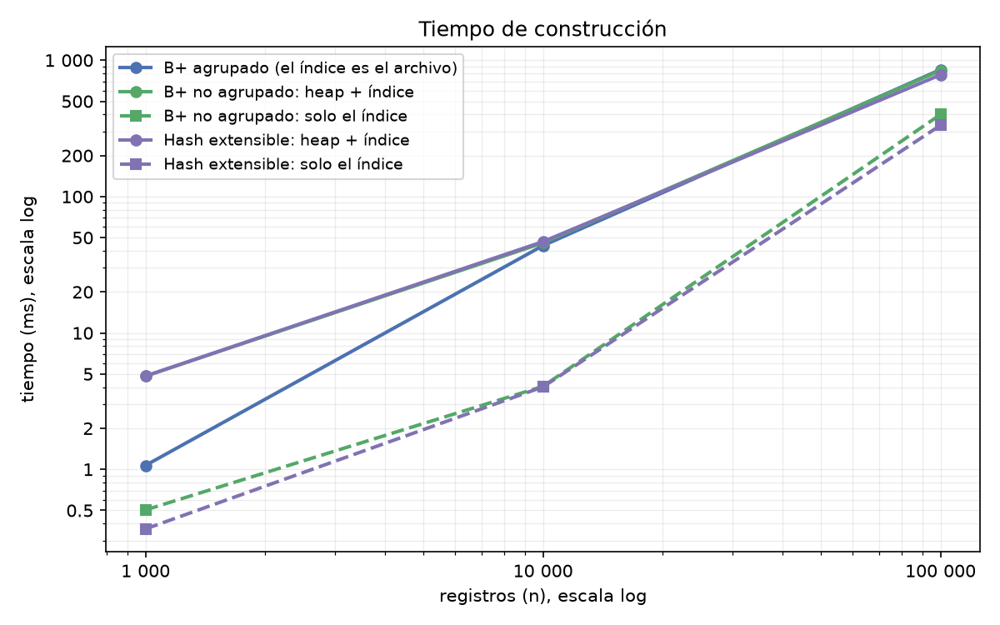
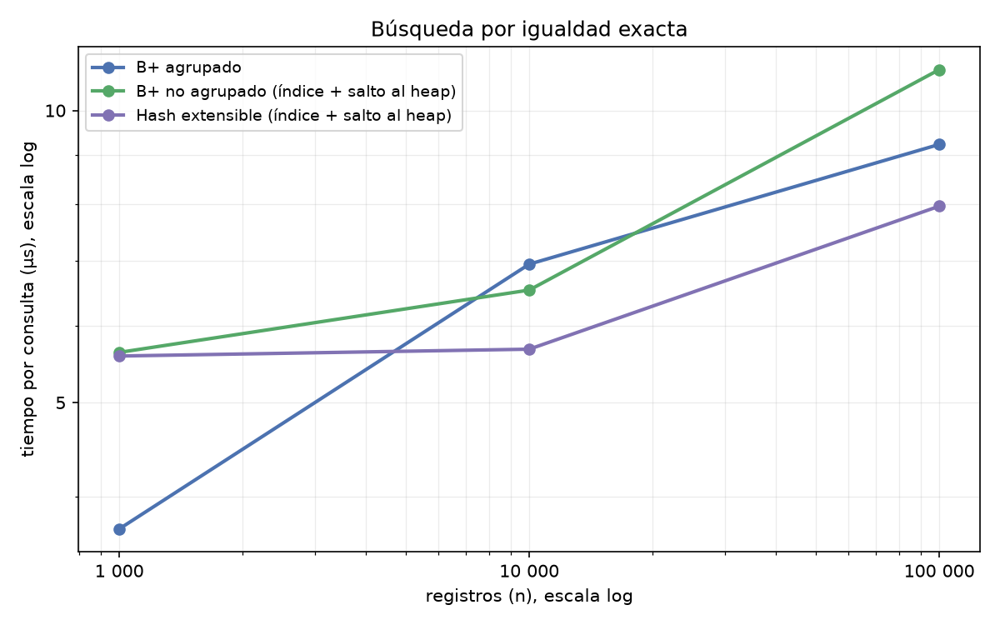
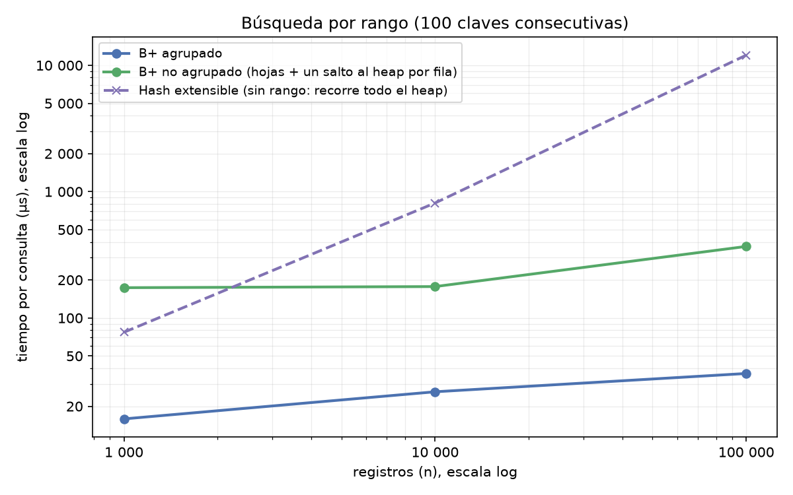
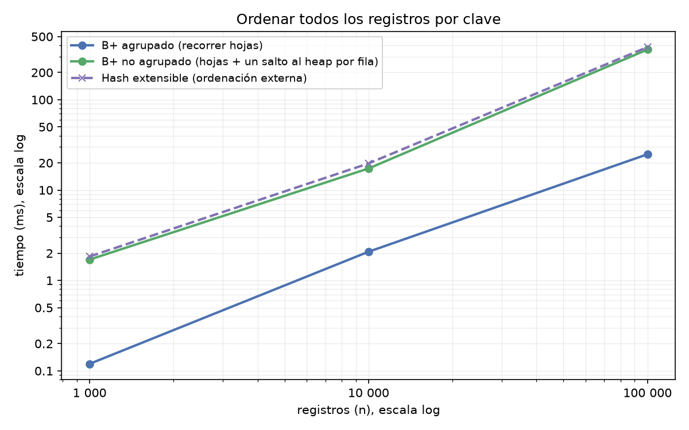
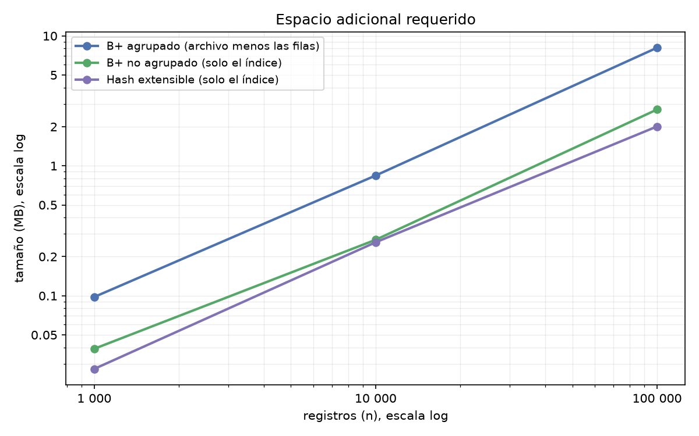
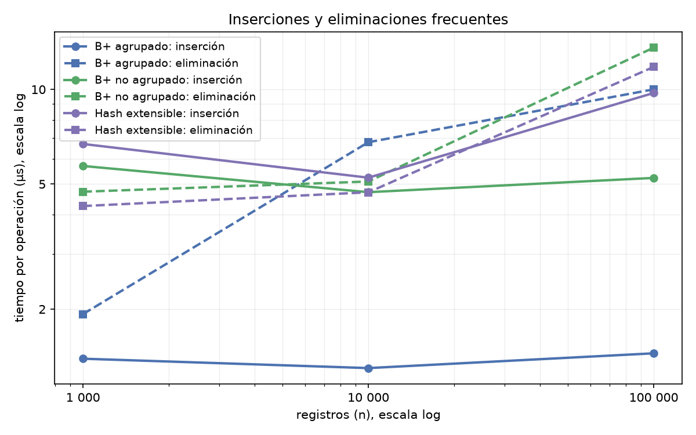

# B+ agrupado vs B+ no agrupado vs Hash extensible

Comparación de los tres índices, todos en disco, con 1 000, 10 000 y 100 000 registros
(claves en orden aleatorio, mediana de 5 corridas). Los ejes van en escala log: una línea que
sube a 45° crece lineal (O(n)) y una casi plana casi no crece.

## Complejidades

`n` = filas, `k` = filas del resultado, `B` = filas por página.

| | igualdad | rango | ordenar | inserción / eliminación | espacio adicional |
|---|---|---|---|---|---|
| B+ agrupado | O(log n) | O(log n + k/B) | O(n/B) | O(log n) | filas completas en las hojas |
| B+ no agrupado | O(log n) + 1 página del heap | O(log n + k) | O(n) saltos al heap | O(log n) + heap | 16 B por fila |
| Hash extensible | O(1) + 1 página del heap | O(n), no ordena | O(n log n), no ordena | O(1) + heap | 16 B por fila + directorio |

---

## 1. Tiempo de construcción

- **B+ agrupado, O(n log n):** cada fila baja por el árbol y se guarda completa.
- **B+ no agrupado, O(n log n):** igual, pero solo guarda la clave y la dirección; las filas
  se cargan antes en el heap.
- **Hash, O(n):** cada clave cae directo en su bucket.

Contando la carga del heap, los tres tardan parecido (780 a 850 ms con 100 000 filas).

## 2. Búsqueda por igualdad exacta

- **Hash, O(1):** siempre 2 páginas de índice (directorio y bucket) y 1 del heap.
- **B+ agrupado, O(log n):** 2 o 3 páginas y ninguna del heap, porque la fila está en la hoja.
- **B+ no agrupado, O(log n) + 1:** 3 páginas de índice y 1 del heap.

Las diferencias son chicas: 8,0, 9,2 y 11,0 µs con 100 000 filas.

## 3. Búsqueda por rango

- **B+ agrupado, O(log n + k/B):** baja una vez y lee hojas seguidas.
- **B+ no agrupado, O(log n + k):** baja una vez, pero cada fila es un salto al heap.
- **Hash, O(n):** no guarda el orden, tiene que recorrer todo. Es la única línea que sube recta.

Con 100 000 filas: 36 µs, 368 µs y 12 030 µs.

## 4. Ordenamiento

- **B+ agrupado, O(n/B):** recorre las hojas enlazadas, que ya están en orden.
- **B+ no agrupado, O(n):** recorre las hojas del índice y salta al heap por cada fila.
- **Hash, O(n log n):** no hay orden, hay que ordenar aparte.

Con 100 000 filas: 25 ms, 359 ms y 382 ms.

## 5. Espacio adicional

- **B+ agrupado:** es el archivo menos las filas, y las hojas no quedan llenas.
- **B+ no agrupado:** 16 B por entrada.
- **Hash:** 16 B por entrada más el directorio.

Las tres crecen lineal. Lo que cambia es cuánto añade cada una por fila: 8,1 MB, 2,7 MB y 2,0 MB
con 100 000 filas.

## 6. Inserciones y eliminaciones frecuentes

- **B+ agrupado, O(log n):** la fila se escribe solo en el árbol.
- **B+ no agrupado, O(log n) + heap:** hay que escribir en el heap y en el índice.
- **Hash, O(1) + heap:** también escribe en el heap y en un bucket.

Con 100 000 filas, insertando: 1,4, 5,2 y 9,7 µs. Eliminando: 10,0, 13,6 y 11,8 µs.

---

## Comparación final

| experimento | ganó | por qué |
|---|---|---|
| 1 construcción | Hash | cada clave cae directo en su bucket, sin bajar por un árbol |
| 2 igualdad exacta | Hash | va directo al bucket de la clave, sin recorrer niveles |
| 3 rango | **B+ agrupado** | las filas están en las hojas enlazadas y ordenadas: baja una vez y lee seguido, sin saltar al heap |
| 4 ordenamiento | **B+ agrupado** | recorre las hojas, que ya están en orden y contienen las filas |
| 5 espacio adicional | Hash | guarda solo la clave y la dirección, sin nodos internos |
| 6 inserción y eliminación | B+ agrupado | escribe la fila solo en el árbol; los otros dos escriben además en el heap |

## En qué casos es mejor cada técnica

- **B+ agrupado:** cuando se busca por la clave principal y se piden rangos o resultados
  ordenados. Las filas están en las hojas, así que no hay que saltar a otro archivo. Ocupa más
  espacio y solo puede haber uno por tabla.
- **B+ no agrupado:** cuando hay que buscar por columnas que no son la clave principal
  (índices secundarios), incluso varios sobre la misma tabla. Guarda solo la clave y la
  dirección, así que ocupa poco; cada fila encontrada cuesta un salto al heap.
- **Hash extensible:** cuando solo se consulta por igualdad exacta y se quiere el acceso más
  directo. No sirve para rangos ni para ordenar.
