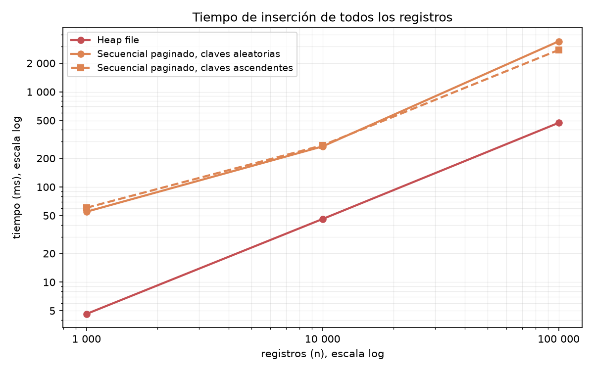
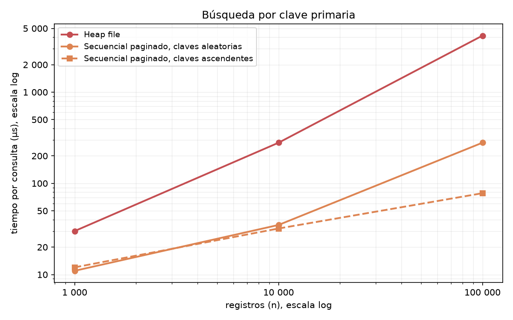
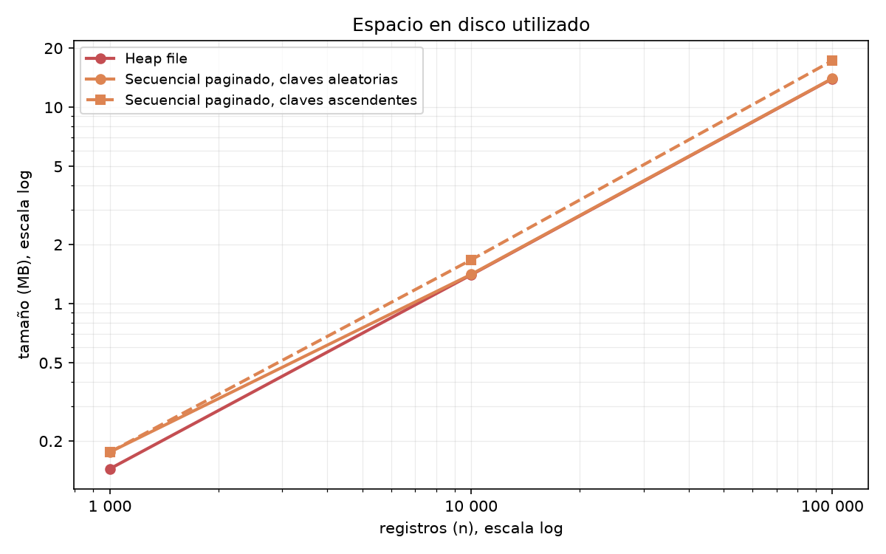
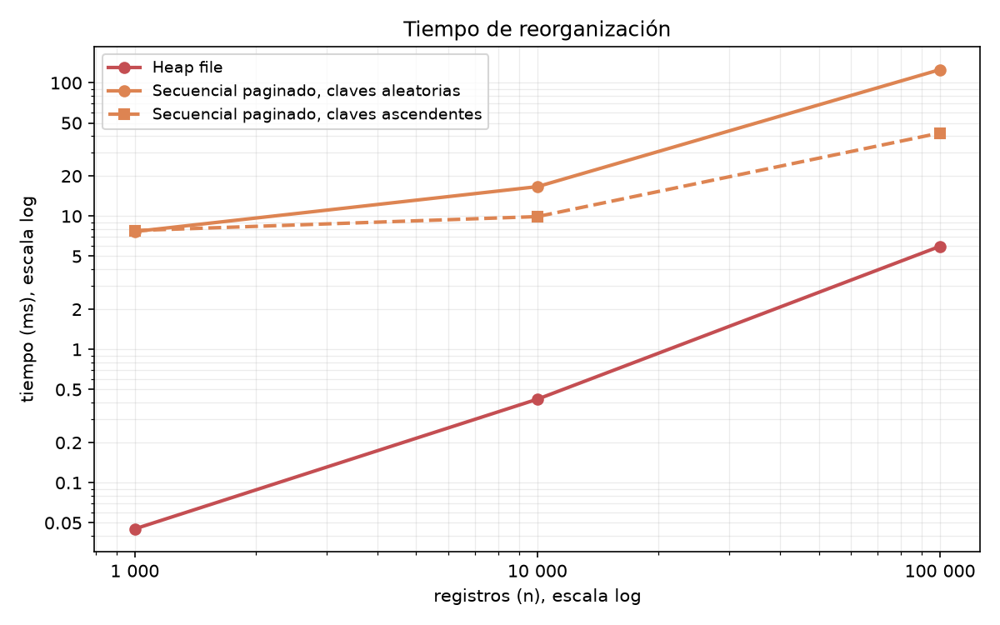

# Heap File vs Archivo Secuencial Paginado

Comparación con 1 000, 10 000 y 100 000 registros (mediana de 5 corridas). El secuencial se
muestra con claves aleatorias y con claves ascendentes porque su resultado depende del orden
en que llegan; el heap da lo mismo en las dos y se dibuja una sola vez. Los ejes van en escala
log: una línea que sube a 45° crece lineal (O(n)) y una casi plana casi no crece.

## Complejidades

`n` = filas.

| | inserción | búsqueda por clave primaria | espacio | reorganización |
|---|---|---|---|---|
| Heap file | O(1) por fila | **O(n)** | n filas en páginas llenas | O(n) |
| Archivo secuencial | O(1) + reorganizar O(n) cuando se llena el área auxiliar | O(log n) + recorrer el área auxiliar | n filas con las páginas al 80 % + área auxiliar | O(n) |

---

## 1. Tiempo de inserción

- **Heap, O(1) por fila:** escribe al final, en la página que indica el mapa de espacio libre.
  Por eso la línea es recta: 4,6 µs por fila en los tres tamaños.
- **Secuencial:** inserta la fila en la página que le toca por clave y, si no cabe, la manda al
  área auxiliar. Cuando el área auxiliar crece demasiado, reorganiza todo el archivo, O(n).

Con 100 000 filas: heap 472 ms; secuencial 3 395 ms (claves aleatorias) y 2 753 ms
(ascendentes).

## 2. Búsqueda por clave primaria

- **Heap, O(n):** no tiene orden, recorre las páginas una por una: 16 → 160 → 1 599 páginas
  y 30 → 279 → 4 161 µs. Es la línea que sube recta.
- **Secuencial, O(log n) + área auxiliar:** busca por mitades en el área ordenada y después
  recorre el área auxiliar. Con claves ascendentes el área auxiliar queda más chica (10 625 registros
  con 100 000 filas): 6 → 20 → 35 páginas y 12 → 32 → 78 µs. Con claves aleatorias queda más
  grande (25 629): 6 → 19 → 115 páginas y 11 → 35 → 279 µs.

## 3. Espacio en disco

Tres rectas paralelas (O(n)); lo que cambia es cuánto desperdicia cada una por fila.

- **Heap:** 14,0 MB con 100 000 filas. Páginas llenas y nada más.
- **Secuencial, claves ascendentes:** 17,3 MB (24 % más). Deja las páginas al 80 % para
  absorber inserciones y además tiene el área auxiliar.
- **Secuencial, claves aleatorias:** 14,0 MB, igual que el heap. Probablemente porque las
  inserciones van rellenando los huecos de las páginas; no lo comprobé.

## 4. Tiempo de reorganización

- **Heap, O(n):** compacta las páginas: 0,045 → 0,42 → 5,9 ms. Es una recta.
- **Secuencial, O(n):** reescribe todo el archivo mezclando el área ordenada con el área
  auxiliar: 7,7 → 17 → 126 ms con claves aleatorias y 7,8 → 9,9 → 42 ms con ascendentes. Con
  aleatorias hay más registros auxiliares que mezclar. A 1 000 filas parece tener un costo
  fijo de unos 7 ms que tapa el O(n); no lo comprobé.

---

## Comparación final

| experimento | ganó | por qué |
|---|---|---|
| 1 inserción | Heap | escribe siempre al final, sin buscar posición ni reorganizar |
| 2 búsqueda por clave primaria | **Secuencial** | está ordenado y busca por mitades en vez de leer todas las páginas |
| 3 espacio en disco | Heap | páginas llenas, sin reserva ni área auxiliar (con claves aleatorias el secuencial lo iguala) |
| 4 reorganización | Heap | solo compacta páginas; el secuencial reescribe todo para mezclar el área auxiliar |

## En qué casos es mejor cada técnica

- **Heap file:** cuando se carga mucho y se recorre todo o casi todo (agregados, `COUNT`,
  `GROUP BY`), o cuando se le pone un índice encima para buscar. Inserta rápido y ocupa lo
  mínimo.
- **Archivo secuencial:** cuando lo más frecuente es buscar por clave primaria y las
  inserciones son pocas o llegan en orden.
