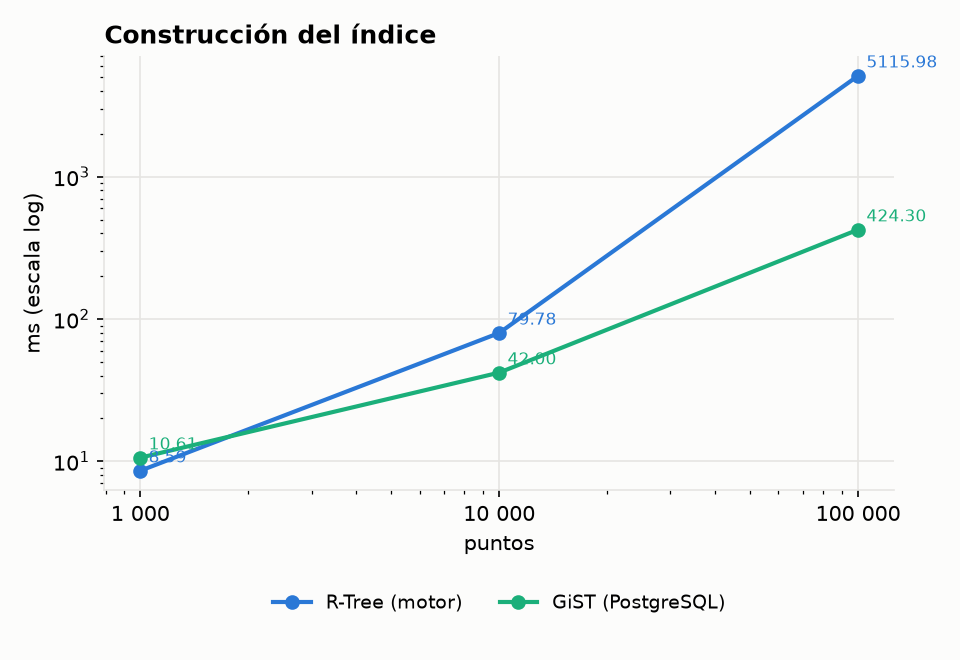
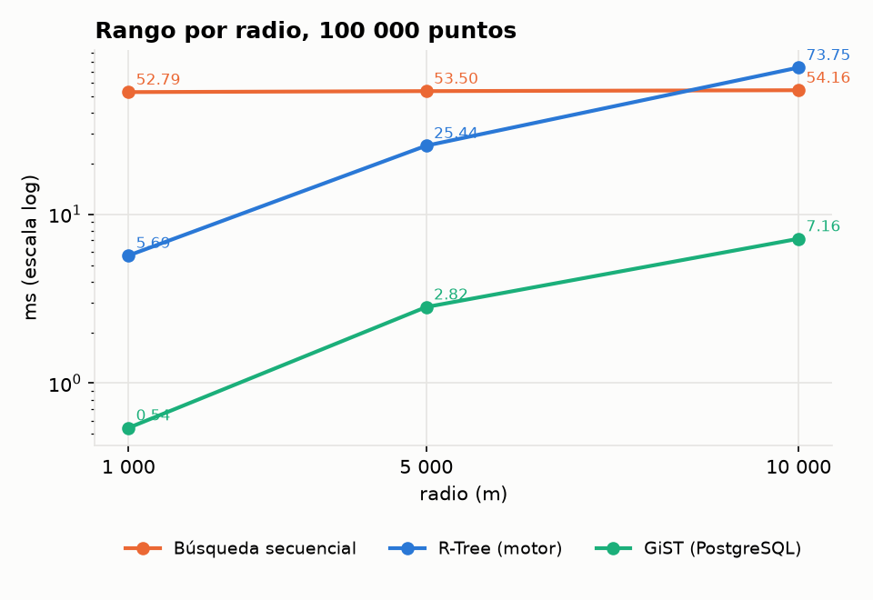
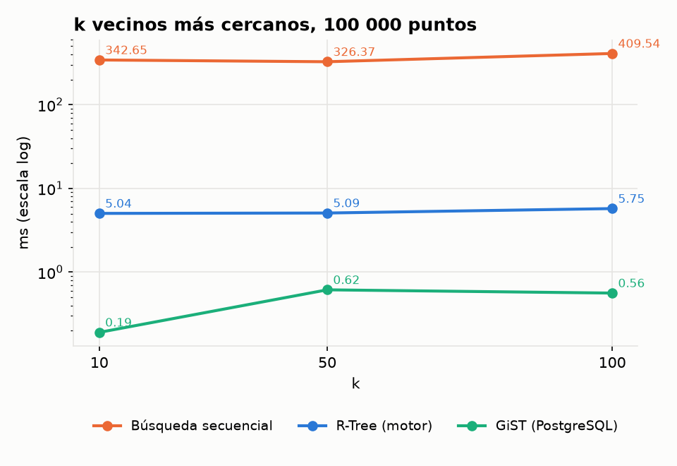

# Comparación espacial: búsqueda secuencial vs R-Tree vs GiST

Sección 2.2.4 del enunciado. Se compara la búsqueda secuencial y el R-Tree del motor con
el índice GiST de PostgreSQL sobre los mismos puntos.

```bash
make bench-espacial                          # secuencial y R-Tree, escribe datos/resultados/espacial_bench.csv
# GiST: abrir datos/resultados/gist_bench.sql en pgAdmin (Query Tool) y ejecutar
python3 docs/comparacion_espacial/graficar.py  # gráficas a partir de los dos CSV
```

## 1. Metodología

- **Datos:** 1 000, 10 000 y 100 000 puntos alrededor de Lima, generados con un congruencial
  de semilla 42. El mismo generador está escrito en C++ (`espacial_bench.cpp`) y en SQL
  (`gist_bench.sql`); las sumas de coordenadas coinciden en los dos lados, así que se miden
  exactamente los mismos puntos.
- **Consultas:** para cada caso, el promedio de 100 consultas con centros tomados de los
  mismos puntos:
  - rango con radios de 1, 5 y 10 km;
  - k-NN con k = 10, 50 y 100.
- **Métrica:** euclidiana en ambos lados, porque es la que calcula GiST con el tipo `point`
  nativo sin PostGIS (los metros se pasan a grados con 111 194,9 m por grado).
- **Motor:** la consulta pasa por todo el motor SQL (parseo, plan, apertura de archivos y
  lectura del heap). La tabla es `HEAP`; el R-Tree se crea con `CREATE INDEX ... USING RTREE`.
- **PostgreSQL 18:** el índice se crea con `CREATE INDEX ... USING gist (p)`. Los tiempos se
  miden dentro de un bloque PL/pgSQL, con la tabla ya en memoria compartida.
- **Validación:** el benchmark del motor verifica que el R-Tree devuelve las mismas filas
  que la búsqueda secuencial, y el promedio de filas de GiST coincide en los 18 casos.

Los tiempos del motor incluyen abrir los archivos y leer el catálogo en cada consulta,
mientras que los de PostgreSQL no. Por eso la comparación justa entre el R-Tree y GiST es
la forma en que crece cada uno, no el valor absoluto.

## 2. Resultados

### Construcción del índice

| n | R-Tree: tiempo | R-Tree: tamaño | GiST: tiempo | GiST: tamaño |
|---:|---:|---:|---:|---:|
| 1 000 | 8,6 ms | 40 KB | 10,6 ms | 72 KB |
| 10 000 | 79,8 ms | 356 KB | 42,0 ms | 680 KB |
| 100 000 | 5 116 ms | 3 448 KB | 424,3 ms | 6 528 KB |



El R-Tree ocupa la mitad que GiST porque guarda solo el MBR y la posición (24 B por
entrada). Su construcción es más lenta con 100 000 puntos porque inserta punto por punto y
lee cada fila del heap a través del motor; GiST lo construye de una sola vez sobre la tabla
ya cargada.

### Rango por radio (100 000 puntos)

| Radio | Filas | Secuencial | R-Tree | GiST |
|---:|---:|---:|---:|---:|
| 1 km | 126 | 52,8 ms | 5,7 ms | 0,54 ms |
| 5 km | 2 895 | 53,5 ms | 25,4 ms | 2,82 ms |
| 10 km | 10 370 | 54,2 ms | 73,7 ms | 7,16 ms |



La búsqueda secuencial cuesta lo mismo con cualquier radio: siempre lee las 491 páginas
del heap. El R-Tree gana con radios chicos (9 veces más rápido con 1 km), pero su costo
crece con el número de filas, porque por cada fila encontrada lee una página del heap. Con
10 km la consulta devuelve el 10 % de la tabla y el R-Tree termina siendo más lento que
recorrer el archivo, igual que pasa con el B+ no agrupado en rangos anchos. GiST sigue la
misma forma, pero unas 10 veces más rápido.

### k vecinos más cercanos (100 000 puntos)

| k | Secuencial | R-Tree | GiST |
|---:|---:|---:|---:|
| 10 | 342,6 ms | 5,0 ms | 0,19 ms |
| 50 | 326,4 ms | 5,1 ms | 0,62 ms |
| 100 | 409,5 ms | 5,7 ms | 0,56 ms |



Aquí está la mayor diferencia. La búsqueda secuencial calcula la distancia de los 100 000
puntos y ordena todo con el merge sort externo antes de cortar en k. El R-Tree baja solo
por los nodos más prometedores (unas 14 páginas entre nodos y heap para k = 10) y su tiempo
casi no depende de k: es entre 64 y 71 veces más rápido que el secuencial.

## 3. Cuándo usar cada técnica

| Técnica | Conviene | No conviene |
|---|---|---|
| Búsqueda secuencial | tablas chicas, o radios que devuelven una parte grande de la tabla | k-NN y radios chicos sobre tablas grandes |
| R-Tree del motor | k-NN y radios chicos o medianos; ocupa la mitad que GiST | radios que devuelven más del 5 al 10 % de la tabla; construcción por inserciones |
| GiST de PostgreSQL | lo mismo que el R-Tree, con construcción más rápida y un motor mucho más optimizado | sin PostGIS solo ofrece distancia euclidiana en grados |

Los resultados crudos están en `datos/resultados/espacial_bench.csv` y
`datos/resultados/gist_bench.csv`.
