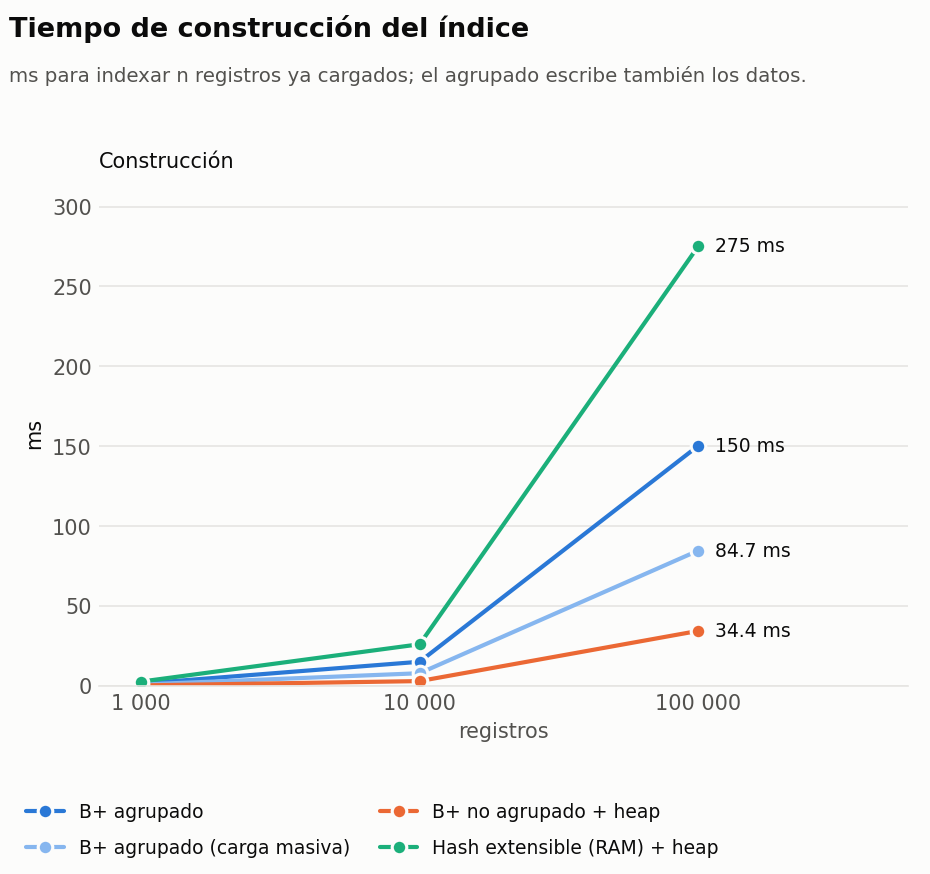
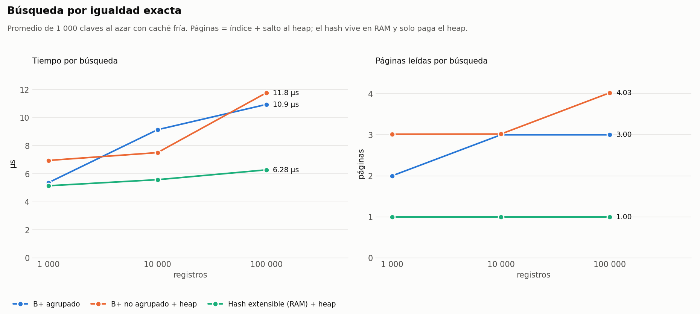
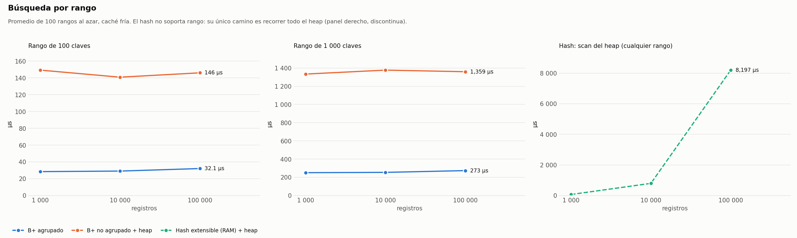
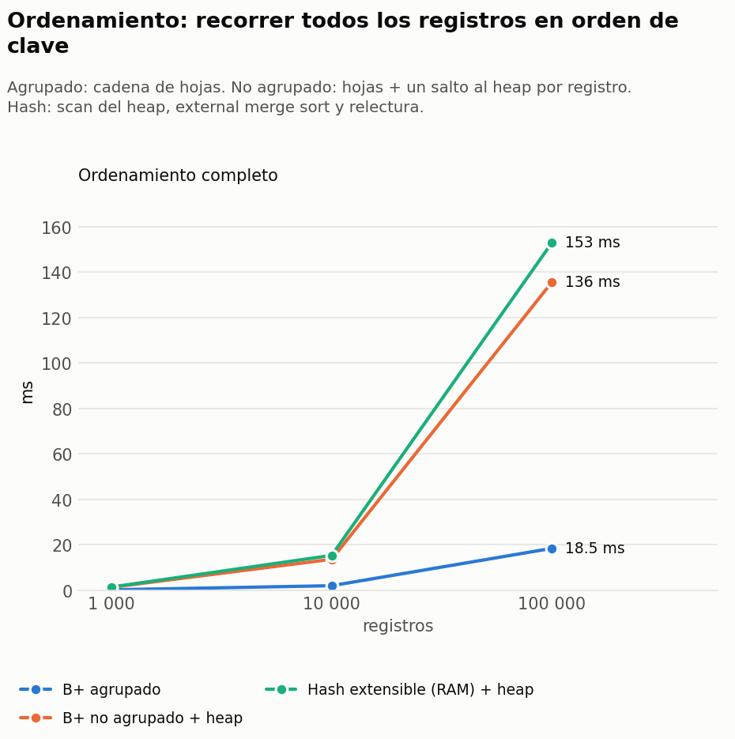
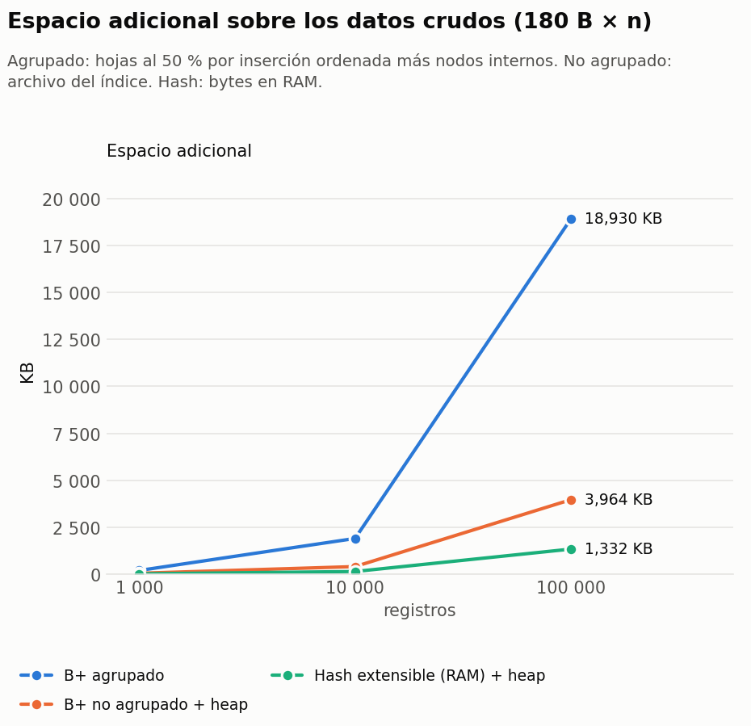
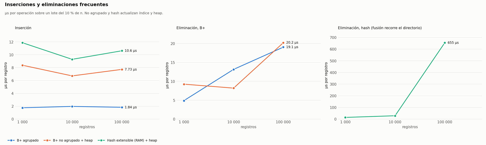

# Comparación experimental de índices

B+ agrupado vs B+ no agrupado vs Hash extensible, sección 2.1.6 del enunciado.
Misma clave (`Index`), mismos registros (180 B), mismas consultas, mismo equipo.

```bash
make bench-indices      # corre motor/pruebas/indices_bench para 1k / 10k / 100k y regenera las gráficas
```

Resultados crudos en [`datos/resultados/indices_bench.csv`](../../datos/resultados/indices_bench.csv);
tabla completa en [`resultados.md`](resultados.md); código en
[`motor/pruebas/indices_bench.cpp`](../../motor/pruebas/indices_bench.cpp) y
[`graficar.py`](graficar.py).

## 1. Qué se comparó

| | B+ agrupado | B+ no agrupado | Hash extensible |
|---|---|---|---|
| Dónde están los datos | en las hojas del árbol | en un heap file; el índice guarda `(Index, RID)` | en un heap file; el índice guarda `(Index, RID)` |
| Dónde vive el índice | disco, páginas de 4 KB, buffer pool de 64 marcos | disco, páginas de 4 KB, buffer pool de 64 marcos | **RAM** (`extendible_hash.h`; la versión en disco está pendiente) |
| Entrada por registro | 180 B (la fila) | 16 B | ~16 B + estructuras de la STL |
| Registros por página | 22 | 205 | bucket de 64 (en memoria) |

Para cada tamaño n ∈ {1 000, 10 000, 100 000} se midió:

- **Construcción**: indexar n registros ya cargados en el heap (el agrupado escribe también los datos; se reporta además su carga masiva).
- **Espacio adicional**: bytes por encima de los datos crudos (`180 × n`).
- **Igualdad**: 1 000 claves al azar, caché fría antes de cada una; tiempo y páginas leídas (índice + salto al heap).
- **Rango**: 100 rangos de 100 y de 1 000 claves, caché fría. El hash no lo soporta: se mide el único camino posible, recorrer el heap (línea discontinua, en su propio panel porque es 250× mayor).
- **Ordenamiento**: devolver los n registros en orden de clave.
- **Inserciones y eliminaciones frecuentes**: un lote del 10 % de n, µs por operación, índice y heap actualizados.

Las lecturas son de página lógica (contadores del motor); los tiempos son de reloj sobre el caché de archivos del sistema operativo, así que reflejan CPU + syscalls, no latencia de disco rotacional. La proporción entre estructuras es la que importa.

## 2. Resultados

### Construcción



El no agrupado es el más rápido de construir (34 ms para 100k) porque cada entrada son 16 B: 205 por página. El agrupado tarda 4× más porque mueve las filas completas, y 10× más si los datos llegan en orden aleatorio (917 ms) por los splits; con carga masiva baja a 85 ms independientemente del orden. El hash en RAM es el más lento (275 ms) por las reservas de memoria de los `unordered_map` por bucket.

### Igualdad exacta



Las tres responden en 6–12 µs. En páginas, el agrupado lee 3 (raíz → interno → hoja, y la fila ya está ahí); el no agrupado 3 + 1 del heap; el hash solo 1 del heap porque su directorio está en RAM. Con el hash en disco serían 2 + 1: directorio, bucket, heap. **Es la única operación donde el hash gana**, y lo hace por poco.

### Rango



Aquí se separan. Para 100 claves el agrupado lee 12 páginas (las hojas consecutivas) y responde en 30 µs; el no agrupado lee 104 (4 del índice + 100 saltos aleatorios al heap) y tarda 146 µs, casi 5×. Para 1 000 claves la brecha es la misma (94 vs 1 013 páginas). El hash no tiene noción de orden: con 100k registros recorre 4 546 páginas del heap y tarda 8 ms, 250× más que el agrupado.

### Ordenamiento



El agrupado devuelve 100k registros ordenados en 18 ms leyendo sus hojas encadenadas. El no agrupado tarda 136 ms: recorre sus hojas en orden pero paga un salto aleatorio al heap por registro. El hash necesita recorrer el heap, ordenar (external merge sort) y releer: 153 ms, y 263 ms si el heap estaba desordenado.

### Espacio adicional



El hash es el más compacto (1.3 MB en RAM), luego el no agrupado (4 MB en disco para 100k, 16 B por entrada más nodos internos). El agrupado aparece con 19 MB adicionales, pero eso es un artefacto de insertar en orden ascendente: cada split deja la hoja izquierda al 50 % y ya no la rellena. Con inserción aleatoria son 8.3 MB y con carga masiva (hojas al 90 %) unos 3 MB. Es un índice que "ocupa" el archivo de datos: el espacio extra son nodos internos más la holgura de las hojas.

### Inserciones y eliminaciones frecuentes



Insertar en el agrupado cuesta 1.8 µs por registro: una sola estructura y el buffer pool absorbe las escrituras. El no agrupado y el hash pagan dos escrituras (heap + índice): 8–11 µs. Al eliminar, el agrupado y el no agrupado se mantienen en 19–20 µs con 100k; el hash sube a 655 µs porque la fusión de buckets de la versión en RAM recorre todo el directorio (2 048 entradas) en cada borrado, un defecto de esa implementación que la versión en disco debe evitar.

## 3. Tabla resumen

| | B+ agrupado | B+ no agrupado | Hash extensible |
|---|---|---|---|
| Igualdad | 3 páginas | 3 + 1 | 2 + 1 (1 + 1 en RAM) — **el mejor** |
| Rango | **el mejor**: hojas consecutivas | 5× más lento: un salto al heap por fila | no soporta; equivale a un scan |
| Ordenamiento | **gratis**: recorrer hojas | 7× más lento | 8× más lento y necesita ordenar aparte |
| Construcción | lenta al insertar; rápida con carga masiva | **la más rápida** | lenta en RAM (reservas); en disco sería comparable al no agrupado |
| Espacio | grande si se inserta ordenado (50 %); bien con carga masiva | pequeño (16 B/entrada) | **el menor** |
| Inserción | **1.8 µs**, una estructura | 8 µs, dos estructuras | 11 µs, dos estructuras |
| Eliminación | ~19 µs | ~20 µs | mala en esta versión (fusión O(directorio)) |
| Cuántos por tabla | solo uno: define el orden físico | varios, sobre cualquier columna INT | varios |
| Claves repetidas | no (es la clave primaria) | sí | sí |

## 4. Conclusiones: cuándo usar cada uno

- **B+ agrupado** para la clave primaria de una tabla que se consulta por rango, se lista ordenada o se recorre completa: rango y ordenamiento son 5–8× más baratos que con cualquier otra estructura porque los datos ya están en el orden del índice. Solo puede haber uno por tabla. Cargar con `cargar_masivo`, nunca insertando en orden ascendente.
- **B+ no agrupado** para índices secundarios sobre columnas que no definen el orden físico (`Founded`, `Number_of_employees`): admite repetidos, es barato de construir y de mantener, y sirve tanto igualdad como rango. Su costo oculto es el salto al heap por cada fila devuelta: con baja selectividad (`Founded = 2019` devuelve el 2 % de la tabla) un scan del heap puede ganarle.
- **Hash extensible** solo cuando la carga de trabajo es igualdad pura sobre una clave única (buscar por ID, verificar existencia de una clave primaria antes de un `INSERT`): ahorra una lectura frente al B+ y es el más compacto. Cualquier `BETWEEN`, `ORDER BY` o `<` lo saca de juego. Las cifras de este informe son de la versión en RAM; hay que repetirlas cuando esté en disco, donde cada búsqueda costará una página de directorio más una de bucket.

## 5. Cómo reproducir

```bash
make bench-indices
# o a mano:
.build/indices_bench --n 1000
.build/indices_bench --n 10000
.build/indices_bench --n 100000
.build/indices_bench --n 100000 --barajar
python3 docs/comparacion_indices/graficar.py
```

Requiere `matplotlib` para las gráficas (`pip install matplotlib`). El benchmark acepta `--consultas`, `--rangos` y `--semilla` para cambiar la carga de trabajo.
